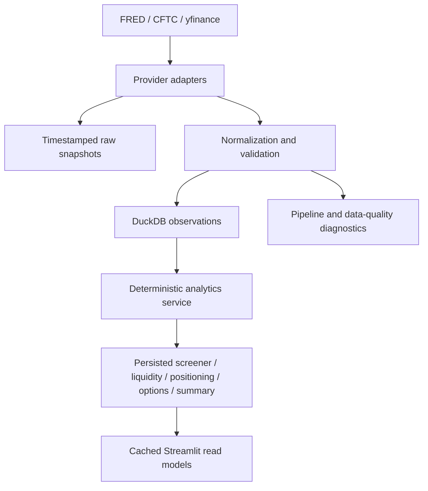

# Architecture

## Boundaries

- Providers isolate source-specific retrieval and never render UI.
- Raw FRED, market, CFTC, and options snapshots are preserved before analytics.
- DuckDB observation writes use natural keys; option snapshots retain unique retrieval IDs.
- `scripts/run_analytics.py` performs expensive calculations and persists prepared outputs.
- Streamlit reads stored analytics through services and caches reads for ten minutes.
- The dashboard never calls external providers during a normal page rerun.

## Time Semantics

- Observation/report date: market or economic period represented.
- Availability/publication date: when data could have become public.
- Ingestion timestamp: local retrieval time.
- Calculation timestamp: deterministic analytics run time.

## Product Pages

Market Overview, Macro Regime, CFTC Positioning, Liquidity & Market-Structure Proxies, Cross-Asset Screener, SPY & QQQ Options, Evidence-Based Market Summary, Data Freshness, and Methodology all read stored data or show actionable empty states.
