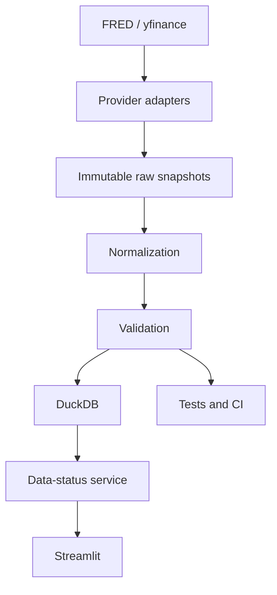

# Architecture

## Implemented Flow

## External Data Sources

- FRED for macro, rates, credit, and liquidity series
- yfinance for free daily historical market prices

## Provider and Ingestion Layer

Providers fetch source-specific payloads, preserve provider symbols and source references, and save immutable raw snapshots before validated storage.

## Data Validation Layer

Validation separates warnings from rejections and preserves timestamps so the pipeline can detect stale, missing, malformed, or duplicate records.

## Storage Layer

Validated data is written to DuckDB, while raw snapshots are stored as immutable Parquet sidecars for traceability.

## Data-Status Layer

The Streamlit app reads only from DuckDB through a service layer. It does not call FRED or yfinance directly.

## AI Boundary

Future AI features must work from validated tables and evidence packets. They must not interpret unrestricted raw provider data directly.

## Operations and Testing

- Unit and integration tests run offline with mocks and synthetic fixtures.
- GitHub Actions runs the same deterministic test suite on push and pull request.
- Structured logging records pipeline progress without exposing secrets.
