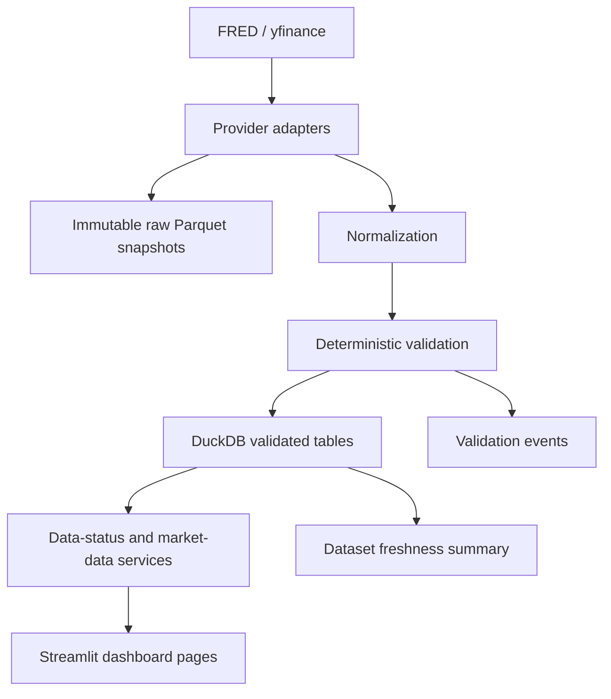

# Architecture

## Phase 2 flow

## Data sources

- FRED provides official macro, rates, inflation, labour, and liquidity series.
- yfinance provides delayed daily market data for the portfolio MVP universe.

## Provider layer

- Provider classes keep source-specific logic isolated.
- Providers never write to DuckDB directly.
- Providers preserve source metadata and return schema-compatible records.

## Raw storage

- Raw or minimally transformed provider payloads are written as Parquet.
- Raw snapshots are partitioned by provider and ingestion date.
- Files are uniquely named per pipeline run so repeated runs do not overwrite earlier snapshots.

## Validation layer

- Validation is deterministic and rule-based.
- Rejections and warnings are stored as data-quality events.
- The system distinguishes missing, stale, delayed, and failed data.

## DuckDB layer

- DuckDB stores validated observations, pipeline runs, quality events, and dataset catalog rows.
- Inserts are idempotent using natural keys.
- The dashboard reads from DuckDB through services instead of querying providers directly.

## Dashboard layer

- `Market Overview` shows the latest stored market data.
- `Macro Snapshot` shows the latest stored FRED data.
- `Data Freshness` shows observation age, ingestion time, and run status separately.
- `Methodology` explains the data boundary and limitations.

## UI boundary

The dashboard does not call FRED or yfinance directly. It only renders data prepared by service classes.

